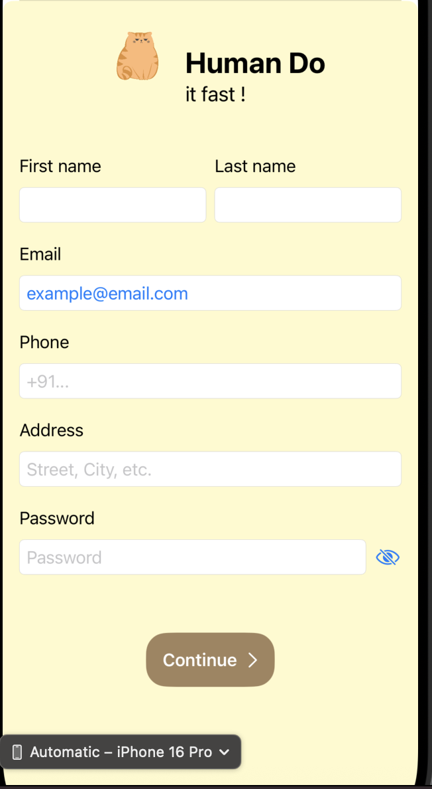
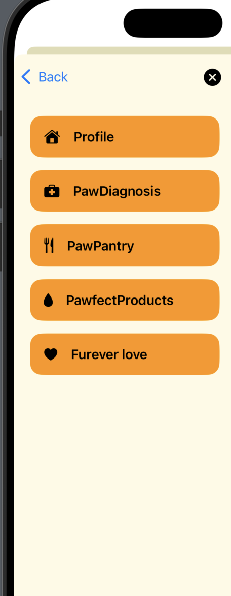

# DoodlesCare-iOS
# 🐶 DoodlesCare – iOS Wellness App for Dogs

A playful, AI-powered iOS wellness app for dog parents. Built using Swift and SwiftUI, the app allows users to create pet profiles, manage care routines, and interact with a fun, conversational AI for personalized recommendations. The project highlights a mobile-first UI/UX design philosophy with a strong emphasis on emotional connection, usability, and creativity.

---

## 🧠 Project Goals

-  Design a whimsical, user-friendly onboarding flow for dog parents  
-  Integrate an AI chatbot for wellness recommendations (e.g., food, grooming, products)  
-  Create modules for medical tracking, pantry management, and personalized engagement  
-  Prioritize mobile UI that feels emotionally warm and playful

---

## 📸 UI Walkthrough

###  Home Screen  

###  Initial Onboarding  

###  Menu 

###  Designs

> 📌 These screenshots represent the working SwiftUI prototype built using Xcode and designed for iPhone 16 Pro simulation.

---

## 🧰 Tools & Technologies

-  **Swift & SwiftUI** for mobile development
-  **OpenAI API** for chatbot integration (under development)
-  Figma for layout wireframes and UI design
-  MVVM architecture for clean data binding
-  Xcode Simulator (iPhone 16 Pro) for testing

---

## 🙋‍♀️ About Me

I'm **Toral Banerjee**, a Computer Science major at Clark University passionate about combining emotional design, AI, and mobile development.  
DoodlesCare is a project born out of my love for dogs and interest in building tech that feels friendly, useful, and joyful.

---

## ⚠️ License Notice

This repository is shared for demonstration purposes only.  
All content © 2025 Toral Banerjee.  
Unauthorized reuse or redistribution is strictly prohibited.
